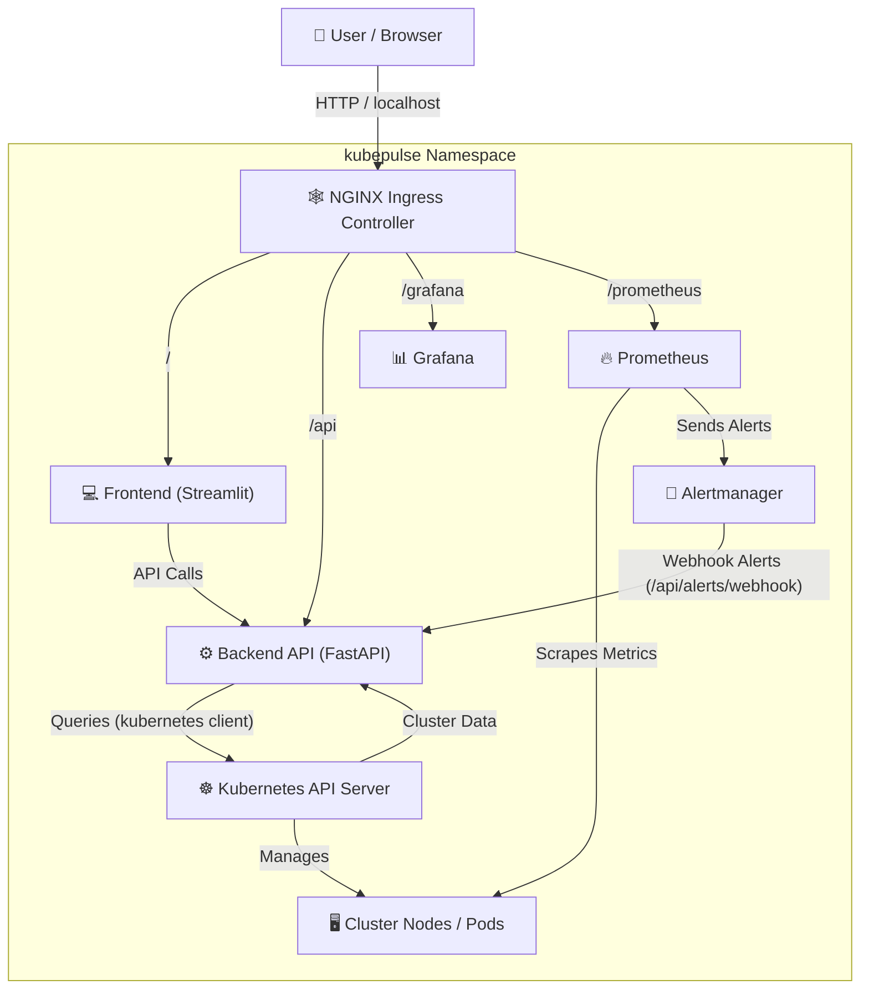
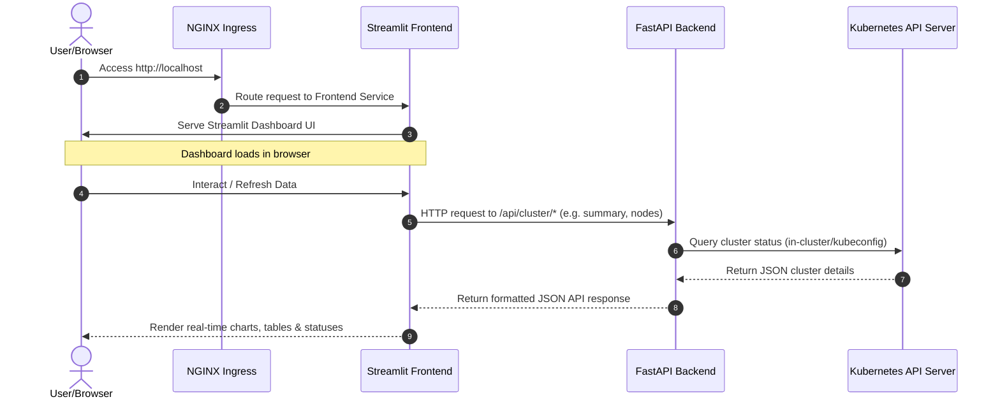

# ⚡ KubePulse - Kubernetes Observability & Monitoring Platform

[](https://kubernetes.io)
[](https://fastapi.tiangolo.com)
[](https://streamlit.io)
[](https://prometheus.io)
[](https://grafana.com)
[](https://kind.sigs.k8s.io)

**KubePulse** is a lightweight, self-contained Kubernetes monitoring and observability solution designed to run inside a local Kubernetes cluster (deployed via **Kind**). It offers real-time infrastructure visibility, pod/deployment status tracking, alert management, and automated dashboard visualization under a single consolidated web interface.

---

## 📖 Table of Contents
1. [Executive Summary](#1-executive-summary)
2. [High-Level Architecture](#2-high-level-architecture)
3. [Request Flow](#3-request-flow)
4. [Project Structure](#4-project-structure)
5. [Infrastructure Configuration](#5-infrastructure-configuration)
6. [Backend Service Deep Dive](#6-backend-service-deep-dive)
7. [Frontend Dashboard](#7-frontend-dashboard)
8. [Kubernetes Manifests & Security](#8-kubernetes-manifests--security)
9. [Workload Deployments](#9-workload-deployments)
10. [Ingress & Traffic Routing](#10-ingress--traffic-routing)
11. [Monitoring Stack](#11-monitoring-stack)
12. [Docker Containers](#12-docker-containers)
13. [Deployment & Verification Workflow](#13-deployment--verification-workflow)
14. [DevOps Concepts Demonstrated](#14-devops-concepts-demonstrated)

---

## 1. Executive Summary

### What is KubePulse?
KubePulse is an internal cluster observation dashboard and metrics pipeline. It queries the live state of Kubernetes workloads, monitors resource usage metrics, and displays active system alerts.

It provides:
- 📈 **Real-time cluster monitoring**: Real-time metrics from namespaces, nodes, deployments, and pods.
- 🖥️ **Infrastructure health visibility**: Instant CPU/Memory capacity gauges per node.
- 📦 **Pod & deployment status tracking**: Quick diagnosis of failed, pending, or crashlooping pods.
- 🔔 **Alert management**: In-memory incident tracking powered by active webhook payloads.
- 📊 **Grafana dashboards**: Embedded dashboard panels with no manual setup.
- ⏱️ **Prometheus metrics collection**: Scraping configuration targets for Kubernetes system internals.
- 🌐 **Centralized web dashboard**: A unified frontend served directly via Streamlit.

### Business Problem Solved
Modern Kubernetes clusters contain highly dynamic, moving parts:
- **Nodes** (physical/virtual machines)
- **Pods** (container groups)
- **Deployments** (desired state managers)
- **Services & Ingresses** (routing rules)
- **System Events** (evictions, schedules, errors)
- **Resource consumption** (CPU throttling, Out Of Memory errors)

Without an integrated observability framework, administrators struggle to diagnose production incidents:
- Which pods are in a `CrashLoopBackOff` state?
- Are worker nodes hitting resource capacity limits?
- Why did a deployment fail to roll out desired replicas?
- What triggered a critical cluster event?

KubePulse resolves this by aggregating and correlation metrics, Kubernetes API statistics, and alerts into a single, intuitive interface.

---

## 2. High-Level Architecture

The cluster architecture isolates monitoring workloads inside the `kubepulse` namespace, allowing secure internal lookups while routing host traffic using the Ingress Controller.



---

## 3. Request Flow

When a user opens `http://localhost`, the system channels requests through the following sequence:



1. **Browser** initiates connection to the host address `http://localhost`.
2. **Ingress Controller** routes traffic to the internal `kubepulse-frontend` service.
3. **Streamlit Frontend** serving code processes the load and returns the web page.
4. **Frontend JavaScript/Python core** makes asynchronous API calls back to `/api/cluster/...` paths.
5. **FastAPI Backend** parses the request and executes API calls.
6. **Kubernetes API Server** authenticates the pod's service account and retrieves active cluster state.
7. **FastAPI Backend** formats raw K8s API responses into clean JSON payloads.
8. **Streamlit Frontend** updates dashboard panels dynamically.

---

## 4. Project Structure

```text
KubePulse
│
├── kind-config.yaml            # Kind cluster port-mapping configuration
├── Project summary.md          # Project description and outcomes
├── implementation_plan.md     # Engineering log and execution blueprints
│
├── backend/                    # FastAPI Backend Application
│   ├── Dockerfile              # Containerization instructions
│   ├── requirements.txt        # Python dependency manifest
│   └── app/
│       ├── main.py             # FastAPI server startup & routing paths
│       ├── k8s_client.py       # Kubernetes API Client integrations
│       └── alerts.py           # In-memory webhook event store
│
├── frontend/                   # Streamlit Dashboard Web Application
│   ├── Dockerfile              # Multi-stage image builder
│   ├── requirements.txt        # Streamlit requirements
│   └── app.py                  # UI layout and metrics display scripts
│
└── k8s/                        # Kubernetes Deployment Manifests
    ├── namespace.yaml          # Isolated namespace 'kubepulse'
    ├── rbac.yaml               # Cluster Role, ServiceAccount, Bindings
    ├── backend.yaml            # Backend API Service and Deployment
    ├── frontend.yaml           # Streamlit Frontend Service and Deployment
    ├── ingress.yaml            # Route definitions for local ingress
    │
    └── monitoring/             # Prometheus Observability Stack
        ├── prometheus.yaml     # Scraper targets & storage resources
        ├── grafana.yaml        # Self-configuring visualization engine
        └── alertmanager.yaml   # Webhook configurations & routing pipelines
```

---

## 5. Infrastructure Configuration

### `kind-config.yaml`
Kind runs Kubernetes nodes inside Docker containers. In order to access web services from the host machine (laptop), port mappings are required.

```yaml
apiVersion: kind.x-k8s.io/v1alpha4
kind: Cluster
nodes:
- role: control-plane
  extraPortMappings:
  - containerPort: 80
    hostPort: 80
    listenAddress: "127.0.0.1"
  - containerPort: 443
    hostPort: 443
    listenAddress: "127.0.0.1"
```

* **Purpose**: Maps ports `80` (HTTP) and `443` (HTTPS) from the physical laptop directly into the Kind control plane node container.
* **Significance**: NGINX Ingress binds to port `80`/`443` internally. This configuration maps the host requests (`http://localhost`) directly to the Ingress controller without needing complex node-port rules or tunnel forwarders.

---

## 6. Backend Service Deep Dive

### `backend/app/main.py`
The FastAPI backend acts as the unified middleware layer. It exposes endpoints that fetch live cluster statistics and exposes a target webhook for Alertmanager events.

| Endpoint | Method | Purpose |
| :--- | :--- | :--- |
| `/health` | `GET` | Return API service health. Used as Kubernetes liveness/readiness probe. |
| `/api/cluster/summary` | `GET` | Aggregated status count (Pods, Nodes, Deployments, Alert counts). |
| `/api/cluster/nodes` | `GET` | List status, CPU capacity, memory sizes, and OS versions for all nodes. |
| `/api/cluster/pods` | `GET` | List pods, restart counters, current statuses, and host nodes. |
| `/api/cluster/deployments`| `GET` | Fetch desired vs ready replicas; reports degraded states. |
| `/api/cluster/events` | `GET` | Stream recent events occurring within the Kubernetes namespace. |
| `/api/alerts/webhook` | `POST` | Receive webhook alert payloads from Alertmanager. |

#### Alert Webhook API Example
Receives HTTP POST payloads from Alertmanager:
```json
{
  "status": "firing",
  "alerts": [
    {
      "labels": {
        "alertname": "PodCrashLooping",
        "severity": "critical",
        "pod": "payment-api-74df-2w"
      },
      "annotations": {
        "summary": "Pod is looping in crash cycles"
      }
    }
  ]
}
```

---

### `backend/app/k8s_client.py`
This module encapsulates the interactions with the core Kubernetes API using the official `kubernetes` SDK.

#### Client Authentication Flow
To support both local workstation testing and in-cluster deployment, the client dynamically loads credentials:
```python
from kubernetes import client, config

try:
    # 1. Attempt to load service account credentials mounted inside the pod
    config.load_in_cluster_config()
except config.ConfigException:
    # 2. Fallback to local user Kubeconfig file (~/.kube/config) during development
    config.load_kube_config()

core_v1 = client.CoreV1Api()
apps_v1 = client.AppsV1Api()
```

#### Metrics & Query Methods
* `get_summary()`: Combines workload counts.
  ```json
  {
    "nodes": { "total": 1, "ready": 1 },
    "pods": { "total": 12, "running": 10, "failed": 1, "pending": 1 },
    "deployments": { "total": 4, "healthy": 3, "degraded": 1 }
  }
  ```
* `get_nodes()`: Compiles node details (Status, CPU cores, Memory allocations, Kubelet versions).
* `get_pods()`: Queries pods across all namespaces to monitor statuses and count container restarts.
* `get_deployments()`: Validates replica sets. If `ready_replicas` < `spec_replicas`, the status is flagged as **`Degraded`**, otherwise **`Healthy`**.
* `get_events()`: Retreives the latest namespace warning and info events to assist in troubleshooting.

---

### `backend/app/alerts.py`
Alerts are stored in-memory in a clean data structure:
```python
active_alerts = {}  # Keyed by Alert Fingerprint
alert_history = []  # Running log of past alerts
```
- **Firing Alerts**: Captured and logged inside `active_alerts`.
- **Resolved Alerts**: Removed from `active_alerts` and appended to `alert_history` with a timestamp offset, updating the dashboard in real-time.

---

## 7. Frontend Dashboard

### `frontend/app.py`
The frontend is written in **Streamlit**, providing a clean, reactive layout to view cluster health indicators.

### Dashboard Sections
1. **Cluster Summary Metric Cards**: Key status indicators showing active workloads and current issues.
2. **Alerts Panel**: Highlight critical active warnings forwarded from Alertmanager.
3. **Deployments Table**: Real-time status mapping showing container counts and replica drifts.
4. **Nodes Monitor**: Displays node compute configurations, system versions, and readiness states.
5. **Pods Status Grid**: Shows pod status, host node, restarts, and container phase.
6. **Kubernetes Events Log**: Displays warning messages and system transitions chronologically.

---

## 8. Kubernetes Manifests & Security

### `k8s/namespace.yaml`
Establishes the resource boundary `kubepulse` to prevent resource collisions with other system processes:
```yaml
apiVersion: v1
kind: Namespace
metadata:
  name: kubepulse
```

### `k8s/rbac.yaml` (Role-Based Access Control)
Secures backend workloads by applying the principle of least privilege.

```yaml
apiVersion: v1
kind: ServiceAccount
metadata:
  name: kubepulse-backend
  namespace: kubepulse
---
apiVersion: rbac.authorization.k8s.io/v1
kind: ClusterRole
metadata:
  name: kubepulse-reader
rules:
- apiGroups: [""]
  resources: ["pods", "nodes", "events", "services"]
  verbs: ["get", "list", "watch"]
- apiGroups: ["apps"]
  resources: ["deployments"]
  verbs: ["get", "list", "watch"]
---
apiVersion: rbac.authorization.k8s.io/v1
kind: ClusterRoleBinding
metadata:
  name: kubepulse-backend-binding
subjects:
- kind: ServiceAccount
  name: kubepulse-backend
  namespace: kubepulse
roleRef:
  kind: ClusterRole
  name: kubepulse-reader
  apiGroup: rbac.authorization.k8s.io
```

* **ServiceAccount**: Identifies the API backend execution context.
* **ClusterRole**: Grants read-only access (`get`, `list`, `watch`) to vital cluster components (pods, nodes, events, services, deployments). It does **not** grant write or delete access.
* **ClusterRoleBinding**: Binds the role to the service account, authorizing the API container to fetch cluster stats.

---

## 9. Workload Deployments

### `k8s/backend.yaml`
Deploys the FastAPI server.
* **Port**: Exposes port `8000`.
* **Resource Allocations**:
  ```yaml
  resources:
    limits:
      cpu: "500m"
      memory: "512Mi"
    requests:
      cpu: "250m"
      memory: "256Mi"
  ```
  Prevents memory leaks or cpu exhaustion from affecting other workloads.
* **Liveness & Readiness Probes**:
  ```yaml
  readinessProbe:
    httpGet:
      path: /health
      port: 8000
    initialDelaySeconds: 5
    periodSeconds: 10
  livenessProbe:
    httpGet:
      path: /health
      port: 8000
    initialDelaySeconds: 15
    periodSeconds: 20
  ```
  Ensures traffic is only routed to the container once it's fully ready, and restarts the container automatically if it becomes unresponsive.

### `k8s/frontend.yaml`
Deploys the Streamlit UI.
* **Port**: Exposes the container on port `8501`.
* **Service**: Exposes the container internally for ingress routing.

---

## 10. Ingress & Traffic Routing

### `k8s/ingress.yaml`
The Ingress manifest configures NGINX to route external host traffic to the correct internal service based on the URL path.

```yaml
apiVersion: networking.k8s.io/v1
kind: Ingress
metadata:
  name: kubepulse-ingress
  namespace: kubepulse
  annotations:
    nginx.ingress.kubernetes.io/rewrite-target: /
spec:
  ingressClassName: nginx
  rules:
  - http:
      paths:
      - path: /
        pathType: Prefix
        backend:
          service:
            name: kubepulse-frontend
            port:
              number: 8501
      - path: /api
        pathType: Prefix
        backend:
          service:
            name: kubepulse-backend
            port:
              number: 8000
      - path: /prometheus
        pathType: Prefix
        backend:
          service:
            name: prometheus
            port:
              number: 9090
      - path: /grafana
        pathType: Prefix
        backend:
          service:
            name: grafana
            port:
              number: 3000
```

---

## 11. Monitoring Stack

### `k8s/monitoring/prometheus.yaml`
Deploys Prometheus to scrape time-series metrics from nodes and containers.
* **Scraper Configs**:
  1. `kubernetes-apiservers`: Monitors API server latency and loads.
  2. `kubernetes-nodes`: Gathers operating system usage metrics (CPU, Memory, Disk, Network) from each node.
  3. `kubernetes-cadvisor`: Fetches system usage metrics for every container running on the node.

### `k8s/monitoring/grafana.yaml`
Deploys Grafana for metric visualization.
* **Automated Data Sources**: Uses a ConfigMap to pre-configure connection settings for Prometheus and Alertmanager data sources automatically on start.
* **Default Dashboard Provisioning**: Automatically loads a default cluster monitoring dashboard JSON file from a ConfigMap, ensuring dashboards are populated immediately at `http://localhost/grafana` without manual configuration.

### `k8s/monitoring/alertmanager.yaml`
Alertmanager processes alert signals from Prometheus and routes them to alert endpoints.
* **Receivers**: A webhook receiver routes alerts directly to the FastAPI API backend at `/api/alerts/webhook`, allowing the dashboard to display critical alerts instantly.

---

## 12. Docker Containers

KubePulse uses containerized execution environments to ensure consistent behavior across environments:

1. **Backend Container**:
   * Runs Python 3.12-slim.
   * Exposes port `8000`.
   * Executable: `uvicorn app.main:app`.
2. **Frontend Container**:
   * Runs Streamlit.
   * Exposes port `8501` (mapped to `80` by Ingress).

---

## 13. Deployment & Verification Workflow

Follow these steps to deploy KubePulse to a local Kind cluster:

### Step 1: Create the Kind Cluster
Use the Kind configuration file to create the cluster with port mappings:
```powershell
kind create cluster --config kind-config.yaml --name kubepulse
```

### Step 2: Deploy the Ingress Controller
Apply the NGINX Ingress Controller manifest and wait for it to become ready:
```powershell
kubectl apply -f https://raw.githubusercontent.com/kubernetes/ingress-nginx/main/deploy/static/provider/kind/deploy.yaml

# Wait for Ingress pods to be running
kubectl wait --namespace ingress-nginx `
  --for=condition=ready pod `
  --selector=app.kubernetes.io/component=controller `
  --timeout=120s
```

### Step 3: Create the Namespace & RBAC Roles
```powershell
kubectl apply -f k8s/namespace.yaml
kubectl apply -f k8s/rbac.yaml
```

### Step 4: Build and Load Docker Images
Build images locally and load them directly into the Kind cluster nodes (eliminating the need for an external container registry):
```powershell
# Build Backend
docker build -t kubepulse-backend:latest ./backend
kind load docker-image kubepulse-backend:latest --name kubepulse

# Build Frontend
docker build -t kubepulse-frontend:latest ./frontend
kind load docker-image kubepulse-frontend:latest --name kubepulse
```

### Step 5: Deploy the Workloads
Deploy backend, frontend, and database services:
```powershell
kubectl apply -f k8s/backend.yaml
kubectl apply -f k8s/frontend.yaml
```

### Step 6: Deploy the Monitoring Stack
Apply Prometheus, Grafana, and Alertmanager configurations:
```powershell
kubectl apply -f k8s/monitoring/prometheus.yaml
kubectl apply -f k8s/monitoring/grafana.yaml
kubectl apply -f k8s/monitoring/alertmanager.yaml
```

### Step 7: Apply Ingress Routes
Activate external HTTP access pathways:
```powershell
kubectl apply -f k8s/ingress.yaml
```

### Step 8: Verify the Deployment
Verify that the services are accessible:

* **Dashboard**: `http://localhost/` (Streamlit UI loads)
* **Backend API**: `http://localhost/api/cluster/summary` (returns JSON status output)
* **Grafana**: `http://localhost/grafana` (access Grafana dashboards)
* **Prometheus**: `http://localhost/prometheus` (view metrics targets and run queries)

---

## 14. DevOps Concepts Demonstrated

This project showcases a wide range of production-grade Cloud-Native and DevOps practices:

* **Local Kubernetes Clusters**: Kind orchestration with multi-container nodes.
* **In-Cluster & Local Client Auth**: Dynamic Kubeconfig resolution.
* **Traffic Routing**: NGINX Ingress path-based routing.
* **Kubernetes RBAC**: ClusterRoles, ClusterRoleBindings, and ServiceAccounts.
* **Health and Healing**: Readiness and liveness probes.
* **Monitoring as Code**: Auto-provisioned Grafana datasources, Grafana dashboards, and Alertmanager hooks.
* **Containerization**: Optimized Docker builds.
* **Alerting Pipelines**: Prometheus metrics alerting routed to webhook receivers.
