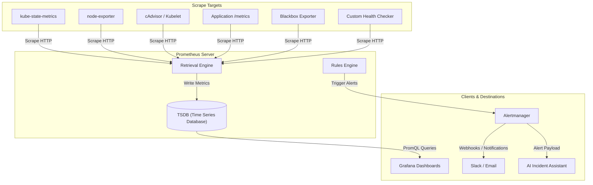

# ⚡ KubePulse: Kubernetes Cluster Health Checker & Healing

[](https://kubernetes.io)
[](https://prometheus.io)
[](#)

A production-grade, Kubernetes-native observability and health monitoring platform designed to provide real-time cluster visibility, proactive health checks, automated healing alerts, and AI-assisted incident response.


### Formal Architecture: Kubernetes Observability & Health Monitoring Platform


#### One-Line Architecture Summary


KubePulse is a Kubernetes-native observability and health management platform that connects a web dashboard to RKE2/Kubernetes, Prometheus, Grafana, Alertmanager, and notification channels to provide real-time cluster visibility, health checks, alerting, and AI-assisted incident response.


### 1. High-Level Goal


The project is a central monitoring and operations dashboard for Kubernetes-based applications.

It should allow users to:


- View real-time status of Kubernetes objects.
- Monitor application and infrastructure health.
- Collect metrics using Prometheus.
- Visualize metrics using Grafana.
- Receive alerts via email, Slack, and AI-assisted summaries.
- Track cluster events, pod failures, restarts, resource usage, and deployment health.
- Optionally take actions such as restart pod, scale deployment, or view logs.


### 2. Proposed Architecture Diagram


### 3. Core Components


#### 3.1 User Interface


The User Interface is the main dashboard where users interact with the platform.

It should show:


- Cluster overview
- Node health
- Pod status
- Deployment status
- Namespace-wise resource usage
- Application health
- Recent Kubernetes events
- Active alerts
- Historical alert timeline
- Grafana embedded dashboards
- Real-time object status

Recommended frontend stack:


- React / Next.js
- TailwindCSS
- WebSocket or Server-Sent Events for live updates
- Grafana iframe embedding or API integration

The UI should not directly talk to Kubernetes or Prometheus. It should communicate only with the backend API.


#### 3.2 Backend API Gateway


The Backend API acts as the control center of the platform.

It receives requests from the UI and routes them to the proper internal service.

Example API responsibilities:


- GET  /api/clusters
- GET  /api/namespaces
- GET  /api/pods
- GET  /api/deployments
- GET  /api/metrics/cpu
- GET  /api/metrics/memory
- GET  /api/alerts
- POST /api/actions/restart-pod
- POST /api/actions/scale-deployment

Recommended backend stack:


- Python FastAPI
- Node.js NestJS
- Go Fiber / Gin

Since you are already familiar with Python, FastAPI would be a strong choice.


#### 3.3 Authentication and RBAC Layer


This layer controls who can access what.

Example user roles:


| Role | Permissions |
| --- | --- |
| Admin | Full access, cluster actions, alert configuration |
| DevOps | View cluster, restart workloads, manage alerts |
| Developer | View application namespace and logs |
| Viewer | Read-only access |

Authentication options:


- LDAP
- OAuth2 / OIDC
- Google Login
- GitHub Login
- Keycloak

Since you previously worked with LDAP authentication, this platform can support LDAP login.

Flow:


### 4. Kubernetes / RKE2 Layer


#### 4.1 RKE2 Kubernetes Cluster


RKE2 is the Kubernetes distribution running your workloads.

This layer contains:


- Control Plane
- Worker Nodes
- Pods
- Deployments
- Services
- Ingress
- ConfigMaps
- Secrets
- Namespaces
- Persistent Volumes

The platform should communicate with Kubernetes using the Kubernetes API.

The backend service should run inside the cluster and use a Kubernetes ServiceAccount with limited RBAC permissions.

Example:

```text
Dashboard Backend Pod
        |
        | in-cluster ServiceAccount
        v
Kubernetes API Server
```

#### 4.2 Kubernetes Integration Service


This service reads Kubernetes objects and sends the data to the UI.

It should collect:


- Nodes
- Namespaces
- Pods
- Deployments
- ReplicaSets
- StatefulSets
- DaemonSets
- Services
- Ingresses
- Events
- ConfigMaps
- Secrets metadata only
- PersistentVolumes
- PersistentVolumeClaims

Example object status:

```json
{
  "namespace": "production",
  "deployment": "payment-service",
  "desiredReplicas": 3,
  "availableReplicas": 2,
  "status": "Degraded",
  "reason": "One pod is in CrashLoopBackOff"
}
```
This service should also support controlled actions:


- Restart pod
- Scale deployment
- Rollout restart deployment
- View pod logs
- View events
- Describe object

Actions must be protected by RBAC and audit logging.


### 5. Health Checker Service


The Health Checker is one of the most important custom components.

Its job is to continuously check whether the cluster and applications are healthy.


#### 5.1 What It Checks


Kubernetes Health


- Node Ready / NotReady
- Pod Running / Pending / Failed
- CrashLoopBackOff
- ImagePullBackOff
- Deployment replica mismatch
- High restart count
- PVC pending
- Ingress unavailable
- Service endpoint missing

Application Health


- HTTP health endpoint
- Readiness endpoint
- Liveness endpoint
- Response time
- Error rate
- Dependency status
- Database connection status

Example:

GET http://payment-service.production.svc.cluster.local/health

Response:

```json
{
  "status": "UP",
  "database": "UP",
  "redis": "UP",
  "version": "1.4.2"
}
```
Version Check

Your sketch mentions “version” near Prometheus and Grafana. This can be formalized as a Version Inventory Module.

It can track:


- Application version
- Docker image tag
- Helm chart version
- Kubernetes version
- RKE2 version
- Prometheus version
- Grafana version
- Node OS version

This is useful for release tracking and debugging.


### 6. Prometheus Metrics Layer


Prometheus will collect and store time-series metrics.


#### 6.1 Prometheus Scraping Targets


Prometheus should scrape:


| Source | Purpose |
| --- | --- |
| kube-state-metrics | Kubernetes object state |
| node-exporter | Node CPU, memory, disk, network |
| cAdvisor / kubelet | Container-level metrics |
| Application /metrics endpoints | Business and app metrics |
| Blackbox exporter | External endpoint checks |
| Custom health checker | Custom health metrics |

Example application metrics:


- http_requests_total
- http_request_duration_seconds
- app_errors_total
- database_connection_status
- queue_pending_jobs


#### 6.2 Prometheus Data Flow




### 7. Grafana Visualization Layer


Grafana should be used for advanced metric visualization.

Dashboards can include:


- Cluster Overview
- Node Resource Usage
- Namespace Resource Usage
- Pod CPU / Memory
- Deployment Health
- Application Latency
- Application Error Rate
- Ingress Traffic
- Database Metrics
- Alert History
- SLO / SLA Dashboard

Grafana can be connected to:


- Prometheus
- Loki, if logs are added
- Tempo, if distributed tracing is added
- PostgreSQL, for custom platform data

The main UI can either:


- Embed Grafana dashboards using iframe.
- Use Grafana API.
- Show summarized metrics directly from Prometheus.

Recommended approach:


- Use your own UI for high-level status.
- Use Grafana for deep metric analysis.


### 8. Alerting Architecture


Alerts should be handled by Prometheus Alertmanager and your custom Alert Service.


#### 8.1 Alert Flow


#### 8.2 Example Alert Rules


Pod CrashLoopBackOff

```yaml
alert: PodCrashLooping
expr: increase(kube_pod_container_status_restarts_total[5m]) > 3
for: 2m
labels:
  severity: critical
annotations:
  summary: "Pod is restarting frequently"
  description: "Pod {{ $labels.pod }} in namespace {{ $labels.namespace }} restarted more than 3 times in 5 minutes."
```
Node Not Ready

```yaml
alert: NodeNotReady
expr: kube_node_status_condition{condition="Ready",status="true"} == 0
for: 5m
labels:
  severity: critical
annotations:
  summary: "Kubernetes node is not ready"
```
High CPU Usage

```yaml
alert: HighCPUUsage
expr: avg(rate(container_cpu_usage_seconds_total[5m])) by (pod) > 0.8
for: 5m
labels:
  severity: warning
annotations:
  summary: "High CPU usage detected"
```

### 9. AI-Based Incident Assistant


Your sketch mentions something like “Slack AI”. This can be expanded into an AI Incident Explanation Service.

Instead of sending raw alerts only, the system can generate helpful summaries.

Example raw alert:

Pod payment-service-7d9f4 is in CrashLoopBackOff.

AI-enhanced alert:


- Incident: payment-service is repeatedly crashing in production.
- Likely causes:
1. Recent deployment may have introduced a runtime error.
2. Environment variable or secret may be missing.
3. Database connection may be failing.
- Recommended actions:
1. Check pod logs.
2. Compare current image version with previous release.
3. Verify ConfigMap and Secret values.
4. Run kubectl describe pod payment-service-7d9f4.

The AI service should receive:


- Alert payload
- Kubernetes events
- Pod logs
- Deployment version
- Recent rollout history
- Prometheus metrics

It should return:


- Incident summary
- Root-cause hints
- Suggested remediation steps
- Severity explanation


### 10. Real-Time Dashboard


The dashboard should show live Kubernetes and application status.


#### 10.1 Real-Time Data Sources


- Kubernetes Watch API
- Prometheus query API
- Health checker results
- Alertmanager webhook events
- Application health endpoints


#### 10.2 Communication Method


Use either:


- WebSocket
- Server-Sent Events
- Polling fallback

Recommended:


- WebSocket for live dashboard updates.
- Polling fallback every 30 seconds if WebSocket fails.

Example flow:


### 11. Data Storage Design


The system should use multiple storage layers.


#### 11.1 PostgreSQL


Used for platform metadata.

Stores:


- Users
- Roles
- Teams
- Cluster registration
- Alert configuration
- Notification channels
- Audit logs
- Dashboard preferences
- Incident history
- Application metadata

Example tables:


- users
- roles
- user_roles
- clusters
- namespaces
- applications
- alert_rules
- notification_channels
- incidents
- audit_logs


#### 11.2 Redis


Used for fast temporary data.

Stores:


- Session cache
- Real-time status cache
- Recent health check results
- Rate limiting counters
- Temporary alert deduplication keys


#### 11.3 Prometheus TSDB


Used for time-series metrics.

Stores:


- CPU usage
- Memory usage
- Pod restart count
- HTTP latency
- Request rate
- Error rate
- Node metrics
- Application metrics


#### 11.4 Optional: Loki


Add Loki if you want centralized logs.


- Pod logs
- Application logs
- System logs
- Ingress logs


#### 11.5 Optional: Tempo / Jaeger


Add distributed tracing for microservices.


- Request traces
- Service-to-service latency
- Dependency chain analysis


### 12. Connectivity Between Components


#### 12.1 UI to Backend


```text
Browser UI
   |
   | HTTPS REST API / WebSocket
   v
Backend API
```
The UI should not directly access Kubernetes, Prometheus, or Grafana using admin credentials.


#### 12.2 Backend to Kubernetes


```text
Backend API
   |
   | Kubernetes Python/Go client
   v
Kubernetes API Server
```
Use in-cluster authentication:


- ServiceAccount
- ClusterRole
- ClusterRoleBinding

Permissions should be limited.

Example read-only permissions:


- resources:
- pods
- services
- deployments
- nodes
- events
- verbs:
- get
- list
- watch

For admin actions, create a separate role.


#### 12.3 Prometheus to Kubernetes


```text
Prometheus
   |
   | Scrapes metrics
   v
kube-state-metrics / node-exporter / app metrics
```
Prometheus does not control Kubernetes. It only collects metrics.


#### 12.4 Alertmanager to Notification Channels


```text
Alertmanager
   |
   | Webhook
   v
Alert Service
   |
   | Email / Slack / AI
   v
Users
```
The custom Alert Service gives you more flexibility than sending directly from Alertmanager.


#### 12.5 Grafana to Prometheus


```text
Grafana
   |
   | PromQL queries
   v
Prometheus
```
Grafana is mainly for visualization and dashboards.


### 13. Recommended Microservices


You can divide the backend into these services.


| Service | Responsibility |
| --- | --- |
| API Gateway | Main entry point for UI |
| Auth Service | Login, JWT, LDAP/OIDC integration |
| Kubernetes Service | Reads Kubernetes objects and events |
| Metrics Service | Queries Prometheus |
| Health Checker Service | Checks app and cluster health |
| Alert Service | Receives alerts and sends notifications |
| AI Incident Service | Generates alert explanations |
| Dashboard Service | Sends real-time updates to UI |
| Audit Service | Stores user actions and system events |

For the first version, you do not need all as separate services. You can start with a modular monolith and split later.

Recommended MVP backend structure:


- backend/
- app/
- main.py
- auth/
- kubernetes/
- metrics/
- health/
- alerts/
- dashboard/
- notifications/
- ai/
- database/


### 14. Deployment Architecture


The entire platform should run inside Kubernetes.


Recommended deployment tools:


- Helm charts
- Argo CD for GitOps
- Docker images
- Kubernetes manifests


### 15. Security Architecture


Security is very important because this platform can access Kubernetes internals.


#### 15.1 Authentication


Use:


- LDAP / OIDC / OAuth2
- JWT access token
- Refresh token
- Session expiration


#### 15.2 Authorization


Use two levels of RBAC:


- Application-level RBAC
- Kubernetes-level RBAC

Example:

```text
User has Developer role
        |
        v
Can view only namespace: dev
        |
        v
Backend uses restricted Kubernetes permissions
```

#### 15.3 Secrets Management


Use:


- Kubernetes Secrets
- External Secrets Operator
- HashiCorp Vault, optional
- Sealed Secrets, optional

Never store secrets in code or Git.


#### 15.4 Audit Logging


Every sensitive action should be logged.

Examples:


- User restarted pod
- User scaled deployment
- User changed alert rule
- User added Slack webhook
- User viewed production logs

Audit log fields:


- user_id
- action
- resource_type
- resource_name
- namespace
- cluster
- timestamp
- ip_address
- result


### 16. Suggested MVP Scope


For the first working version, build only the core platform.

MVP Features


- Login
- Cluster overview dashboard
- Namespace list
- Pod list
- Deployment list
- Node health
- Pod status
- Basic health checker
- Prometheus integration
- Grafana dashboard link/embed
- Slack/email alerting
- Real-time dashboard updates
- Audit logs

Do not start with full AI automation, multi-cluster, tracing, and advanced remediation. Add them later.


### 17. MVP Architecture


### 18. Development Roadmap


Phase 1: Foundation

Build the base project.

Deliverables:


- Frontend skeleton
- Backend API skeleton
- Docker setup
- Kubernetes deployment manifests
- PostgreSQL integration
- Redis integration
- Authentication setup
- Basic UI layout

Phase 2: Kubernetes Integration

Add Kubernetes object visibility.

Deliverables:


- Connect backend to Kubernetes API
- Show nodes
- Show namespaces
- Show pods
- Show deployments
- Show pod status
- Show Kubernetes events
- Add namespace filtering
- Add cluster summary cards

Example dashboard cards:


- Total Nodes: 5
- Healthy Nodes: 4
- Running Pods: 132
- Failed Pods: 3
- Active Alerts: 7
- CPU Usage: 64%
- Memory Usage: 71%

Phase 3: Prometheus and Grafana

Add monitoring.

Deliverables:


- Install Prometheus
- Install kube-state-metrics
- Install node-exporter
- Install Grafana
- Create base dashboards
- Expose Prometheus query API through backend
- Show CPU/memory charts in UI

Phase 4: Health Checker

Add custom health checking.

Deliverables:


- Create Health Checker service
- Check application endpoints
- Check pod restart count
- Check deployment availability
- Check service endpoint availability
- Store health result in Redis/PostgreSQL
- Show health status in dashboard

Health result model:

```json
{
  "service": "payment-service",
  "namespace": "production",
  "status": "degraded",
  "reason": "2 of 3 replicas available",
  "lastCheckedAt": "2026-05-31T10:30:00Z"
}
```
Phase 5: Alerting

Add alert rules and notifications.

Deliverables:


- Configure Alertmanager
- Create Prometheus alert rules
- Build Alert Service webhook
- Add Slack notification
- Add email notification
- Show active alerts in UI
- Store alert history

Phase 6: Real-Time Dashboard

Add live updates.

Deliverables:


- WebSocket backend
- Kubernetes watch integration
- Live pod status updates
- Live alert updates
- Live health status updates
- Frontend real-time refresh

Phase 7: AI Incident Assistant

Add intelligent alert explanation.

Deliverables:


- Send alert data to AI service
- Include logs/events/metrics context
- Generate incident summary
- Generate likely cause
- Generate suggested fix
- Send enriched message to Slack/email
- Show AI summary in dashboard

Phase 8: Production Hardening

Prepare for real usage.

Deliverables:


- TLS everywhere
- RBAC hardening
- Network policies
- Rate limiting
- Audit logging
- Backup strategy
- High availability setup
- Resource requests/limits
- Helm chart
- Argo CD deployment
- Monitoring for the monitoring system itself


### 19. Final Recommended Tech Stack


| Layer | Recommended Tool |
| --- | --- |
| Kubernetes | RKE2 |
| Frontend | React / Next.js |
| Backend | FastAPI |
| Auth | LDAP + JWT, later OIDC |
| Database | PostgreSQL |
| Cache | Redis |
| Metrics | Prometheus |
| Visualization | Grafana |
| Alerts | Alertmanager |
| Notifications | Slack, Email |
| Logs | Loki, optional |
| Tracing | Tempo or Jaeger, optional |
| Deployment | Helm |
| GitOps | Argo CD |
| AI Layer | LLM-based incident summarizer |


### 20. Suggested Final System Name

===============================================================================================

# Readme.md file for AWS:

# ⚡ KubePulse: Kubernetes Cluster Health Checker & Observability Platform on AWS EKS 
### A system that continuously checks the “pulse” of your Kubernetes cluster and applications.

[](https://aws.amazon.com/eks/)
[](https://kubernetes.io)
[](https://docker.com)
[](https://prometheus.io)
[](https://grafana.com)
[](https://prometheus.io/docs/alerting/latest/alertmanager/)
[](https://fastapi.tiangolo.com/)
[](https://react.dev/)
[](LICENSE)

---

# Project Overview

**KubePulse** is a production-style Kubernetes observability platform deployed on **Amazon Elastic Kubernetes Service (AWS EKS)** that provides centralized monitoring, visualization, health analysis, and alert management for Kubernetes workloads.

The platform combines **React**, **FastAPI**, **Prometheus**, **Grafana**, and **Alertmanager** into a unified monitoring dashboard capable of displaying real-time Kubernetes cluster information while collecting metrics, evaluating alert rules, and receiving Alertmanager webhook notifications.

Unlike a traditional monitoring stack where Prometheus and Grafana are used independently, KubePulse integrates Kubernetes APIs, Prometheus metrics, Alertmanager notifications, and a custom backend into a single operational dashboard.

The project was completely developed using **Visual Studio Code** and deployed onto an **AWS EKS cluster** using Docker containers and Kubernetes manifests.

---

# Project Objectives

The primary objectives of KubePulse are:

- Deploy a production-ready Kubernetes monitoring platform on AWS EKS.
- Monitor Kubernetes cluster health in real time.
- Visualize cluster resources through a custom React dashboard.
- Collect infrastructure metrics using Prometheus.
- Display historical and live metrics through Grafana.
- Receive alerts from Alertmanager using custom webhooks.
- Provide a centralized backend API for Kubernetes resource management.
- Demonstrate production deployment practices on AWS Cloud.

---

# Technology Stack

| Layer | Technology |
|---------|------------|
| Cloud Platform | AWS |
| Kubernetes | Amazon EKS |
| Container Runtime | Docker |
| IDE | Visual Studio Code |
| Frontend | React.js |
| Backend | FastAPI (Python) |
| Monitoring | Prometheus |
| Visualization | Grafana |
| Alerting | Alertmanager |
| Metrics Exporters | kube-state-metrics, cAdvisor |
| Kubernetes Client | Python Kubernetes Client |
| Deployment | Kubernetes YAML Manifests |

---

# AWS Architecture

The entire monitoring platform is deployed inside an Amazon EKS cluster.

```
                    Internet
                        │
                        │
                AWS Load Balancer
                        │
        ┌───────────────┴───────────────┐
        │                               │
        │          AWS VPC              │
        │                               │
        │      Amazon EKS Cluster       │
        │                               │
        │ ┌───────────────────────────┐ │
        │ │ Worker Node               │ │
        │ │                           │ │
        │ │ React Frontend            │ │
        │ │ FastAPI Backend           │ │
        │ │ Prometheus                │ │
        │ │ Alertmanager              │ │
        │ │ Grafana                   │ │
        │ │ kube-state-metrics        │ │
        │ │ cAdvisor                  │ │
        │ └───────────────────────────┘ │
        │                               │
        └───────────────────────────────┘
```

---

# High-Level Architecture

```text
                 +-----------------------+
                 |    React Dashboard    |
                 +-----------+-----------+
                             |
                      REST API Calls
                             |
                             ▼
                +-------------------------+
                |     FastAPI Backend     |
                +-----------+-------------+
                            |
        -----------------------------------------------
        |              |              |               |
        ▼              ▼              ▼               ▼
 Kubernetes API   Prometheus     Alertmanager     Grafana
        |              |              |               |
        |              |              |               |
        ▼              ▼              ▼               ▼
 Nodes / Pods     Metrics DB     Webhook Events   Dashboards
```

---

# Production Workflow

```
Developer

     │

     ▼

Visual Studio Code

     │

     ▼

Docker Build

     │

     ▼

Docker Image

     │

     ▼

Amazon EKS

     │

     ▼

Kubernetes Pods

     │

     ▼

Prometheus Metrics

     │

     ▼

Alertmanager

     │

     ▼

FastAPI Webhook

     │

     ▼

React Dashboard
```

---

# AWS Infrastructure

The project was deployed on AWS using the following infrastructure.

| Resource | Purpose |
|-----------|----------|
| AWS Account | Cloud Infrastructure |
| Amazon VPC | Networking |
| Public Subnets | Worker Node Connectivity |
| Internet Gateway | Internet Access |
| Amazon EKS | Managed Kubernetes Cluster |
| EC2 Worker Nodes | Run Kubernetes Workloads |
| IAM Roles | Cluster Authentication |
| Security Groups | Network Security |
| Elastic Load Balancer | External Access |

---

# Amazon EKS Cluster

The monitoring platform runs entirely inside an Amazon Elastic Kubernetes Service (EKS) cluster.

The EKS cluster provides:

- Managed Kubernetes Control Plane
- Automatic Kubernetes API management
- Worker node orchestration
- Service discovery
- High availability
- Rolling deployments
- Self-healing workloads

Worker nodes host the following Kubernetes workloads:

- Frontend
- Backend
- Prometheus
- Grafana
- Alertmanager
- kube-state-metrics

---

# Development Environment

The complete application was developed using **Visual Studio Code**.

Development workflow:

1. Source code edited in VS Code
2. Docker images built locally
3. Images pushed to Kubernetes
4. Deployments updated using kubectl
5. Services verified on AWS EKS
6. Monitoring stack validated
7. Alert pipeline tested

---

# Docker Workflow

Every application component is containerized.

```
Source Code

     │

     ▼

Docker Build

     │

     ▼

Docker Image

     │

     ▼

Kubernetes Deployment

     │

     ▼

Running Pod
```

Example build commands:

```bash
docker build -t kubepulse-backend .
docker build -t kubepulse-frontend .
```

Deploy updated images:

```bash
kubectl rollout restart deployment kubepulse-backend -n kubepulse

kubectl rollout restart deployment kubepulse-frontend -n kubepulse
```

---

# Project Structure

```text
KubePulse
│
├── frontend/
│   ├── src/
│   ├── components/
│   ├── pages/
│   └── services/
│
├── backend/
│   ├── app/
│   │    ├── alerts.py
│   │    ├── k8s_client.py
│   │    ├── main.py
│   │    └── metrics.py
│   │
│   ├── Dockerfile
│   └── requirements.txt
│
├── kubernetes/
│   ├── backend-deployment.yaml
│   ├── frontend-deployment.yaml
│   ├── prometheus.yaml
│   ├── grafana.yaml
│   ├── alertmanager.yaml
│   └── rbac.yaml
│
├── diagrams/
│
└── README.md
```

---

# Major Components

The platform consists of six primary services:

- React Frontend
- FastAPI Backend
- Kubernetes API
- Prometheus
- Grafana
- Alertmanager

Each component performs a dedicated responsibility while working together as an integrated observability platform.

---

# React Frontend

The React frontend serves as the primary user interface for KubePulse. It provides real-time visibility into the Kubernetes cluster by consuming REST APIs exposed by the FastAPI backend.

Unlike directly querying Kubernetes or Prometheus, the frontend communicates only with the backend service, making the architecture secure, modular, and easier to maintain.

The dashboard is designed to present cluster information in a clean and intuitive manner, allowing operators to quickly identify unhealthy workloads, monitor infrastructure health, and review active alerts.

---

## Frontend Responsibilities

The React application provides:

- Cluster Overview Dashboard
- Node Health Monitoring
- Namespace Information
- Pod Status Monitoring
- Deployment Status
- Kubernetes Events
- Active Alert List
- Historical Alerts
- Grafana Dashboard Integration
- Auto-refresh Dashboard
- Responsive User Interface

---

## Frontend Architecture

```text
                 React Frontend
                        │
                        │ REST API
                        ▼
               FastAPI Backend
                        │
        ┌───────────────┼───────────────┐
        ▼               ▼               ▼
 Kubernetes API   Prometheus API   Alert Store
```

---

## Dashboard Overview

The dashboard displays the following information:

### Cluster Summary

- Total Nodes
- Healthy Nodes
- Namespaces
- Running Pods
- Failed Pods
- Deployments
- Active Alerts

---

### Kubernetes Resources

Users can browse:

- Nodes
- Pods
- Namespaces
- Deployments
- Services
- Events

---

### Monitoring

The dashboard also displays:

- CPU Usage
- Memory Usage
- Pod Health
- Deployment Availability
- Cluster Events
- Alert Notifications

---

# FastAPI Backend

The backend is implemented using **FastAPI** and acts as the central API layer for the platform.

Instead of allowing the frontend to communicate directly with Kubernetes or Prometheus, all requests pass through the backend.

This architecture improves:

- Security
- Maintainability
- Scalability
- Authentication
- RBAC
- Future extensibility

---

## Backend Responsibilities

The backend is responsible for:

- Reading Kubernetes resources
- Querying Prometheus metrics
- Receiving Alertmanager webhooks
- Storing active alerts
- Maintaining alert history
- Returning cluster summary
- Providing REST APIs to the frontend

---

## Backend Architecture

```text
             React Dashboard
                     │
                     ▼
              FastAPI Backend
                     │
     ┌───────────────┼────────────────┐
     ▼               ▼                ▼
 Kubernetes API  Prometheus API  Alertmanager
```

---

## Backend Folder Structure

```text
backend/

├── app/
│
├── alerts.py
├── k8s_client.py
├── main.py
├── metrics.py
├── Dockerfile
├── requirements.txt
└── README.md
```

---

## Core Backend Modules

### main.py

Acts as the FastAPI application entry point.

Responsibilities:

- API registration
- Alert webhook endpoint
- Cluster APIs
- Health endpoint
- CORS configuration

---

### alerts.py

Maintains application alert state.

Responsibilities:

- Store active alerts
- Store alert history
- Remove resolved alerts
- Deduplicate alerts
- Expose alert APIs

---

### k8s_client.py

Responsible for Kubernetes API communication.

Uses:

- Kubernetes Python Client

Retrieves:

- Nodes
- Pods
- Deployments
- Events
- Namespaces

---

# Backend REST APIs

The backend exposes the following REST endpoints.

| Method | Endpoint | Description |
|----------|---------------------------|------------------------------|
| GET | /health | Backend health |
| GET | /api/cluster/summary | Cluster overview |
| GET | /api/cluster/nodes | Node list |
| GET | /api/cluster/pods | Pod list |
| GET | /api/cluster/deployments | Deployment list |
| GET | /api/cluster/namespaces | Namespace list |
| GET | /api/cluster/events | Cluster events |
| GET | /api/cluster/alerts | Active alerts |
| POST | /api/alerts/webhook | Alertmanager webhook |

---

# Kubernetes Integration

The backend communicates directly with the Kubernetes API Server using the Kubernetes Python client.

Since the backend runs inside Amazon EKS, it authenticates using an in-cluster ServiceAccount rather than a kubeconfig file.

This follows Kubernetes production best practices.

---

## Kubernetes Objects Retrieved

The backend retrieves:

- Nodes
- Namespaces
- Pods
- Deployments
- ReplicaSets
- Events

Additional resources can be added in future releases.

---

## Kubernetes Communication Flow

```text
React Dashboard

       │

       ▼

FastAPI Backend

       │

       ▼

Kubernetes Python Client

       │

       ▼

Kubernetes API Server

       │

       ▼

Amazon EKS Cluster
```

---

# Kubernetes Resource Monitoring

The backend continuously retrieves Kubernetes resource information including:

## Nodes

Displays:

- Node Name
- Status
- Kubernetes Version
- Roles
- Internal IP

---

## Pods

Displays:

- Namespace
- Pod Name
- Status
- Restart Count
- Node Assignment

---

## Deployments

Displays:

- Desired Replicas
- Available Replicas
- Ready Replicas
- Deployment Status

---

## Events

Displays:

- Type
- Reason
- Namespace
- Object
- Timestamp
- Message

---

# Prometheus Monitoring

Prometheus is responsible for collecting and storing time-series metrics from the Kubernetes cluster.

It periodically scrapes exporters running inside the cluster and stores metrics in its internal TSDB database.

---

## Metrics Sources

Prometheus scrapes metrics from:

- kube-state-metrics
- cAdvisor
- Kubernetes API
- Application Metrics
- Node Metrics

---

## Prometheus Architecture

```text
              Prometheus

                   │

       ┌───────────┼───────────┐

       ▼           ▼           ▼

kube-state    cAdvisor     Applications

 metrics

```

---

## Metrics Collected

Infrastructure metrics include:

- CPU Usage
- Memory Usage
- Disk Usage
- Network Usage
- Node Status
- Pod Status
- Deployment Availability

---

## Prometheus Targets

| Target | Purpose |
|-------------|-----------------------------|
| kube-state-metrics | Kubernetes Objects |
| cAdvisor | Container Metrics |
| Kubernetes API | Cluster Information |
| Backend Metrics | Custom Metrics |

---

# kube-state-metrics

kube-state-metrics exposes Kubernetes object information in Prometheus format.

Unlike cAdvisor, it focuses on Kubernetes resource states rather than infrastructure utilization.

It provides metrics for:

- Deployments
- Pods
- Nodes
- ReplicaSets
- StatefulSets
- Services
- Namespaces

---

# cAdvisor

cAdvisor provides container-level resource utilization metrics.

These metrics include:

- CPU Usage
- Memory Usage
- Filesystem Usage
- Network Statistics

These metrics are used by Prometheus to generate alert rules.

---

# Grafana Integration

Grafana connects directly to Prometheus and provides visualization dashboards.

The React dashboard focuses on operational status, while Grafana provides advanced metric exploration.

---

## Grafana Dashboards

Available dashboards include:

- Cluster Overview
- Node Resources
- Pod Resources
- Namespace Metrics
- CPU Usage
- Memory Usage
- Network Traffic
- Container Utilization

---

## Grafana Data Flow

```text
Prometheus

      │

      ▼

Grafana

      │

      ▼

Interactive Dashboards
```

---

## Why Both React and Grafana?

The React dashboard provides:

- Operational status
- Kubernetes resources
- Alerts
- Cluster overview

Grafana provides:

- Time-series analysis
- Historical trends
- Interactive charts
- Advanced PromQL visualizations

Together they create a complete observability platform.

---

---

# 6. Monitoring & Observability Stack

KubePulse uses a cloud-native observability stack to continuously monitor Kubernetes resources, collect metrics, generate alerts, and provide real-time operational visibility.

The monitoring stack is deployed directly inside the Amazon EKS cluster.

### Components

| Component | Purpose |
|------------|----------|
| Prometheus | Collects and stores Kubernetes metrics |
| kube-state-metrics | Exposes Kubernetes object metrics |
| cAdvisor | Container CPU and memory metrics |
| Kubelet Metrics | Node and Pod resource metrics |
| Alertmanager | Processes Prometheus alerts and forwards notifications |
| Grafana | Visualizes metrics through dashboards |
| FastAPI Backend | Provides REST APIs to the frontend |
| React Dashboard | Displays cluster health in real time |

---

# 7. Prometheus Metrics Collection

Prometheus continuously scrapes metrics from Kubernetes components using pull-based scraping.

### Scrape Targets

- Kubernetes API Server
- kube-state-metrics
- kubelet
- cAdvisor
- Node Metrics
- FastAPI Backend
- Custom Application Metrics

Example metrics collected:

- CPU Usage
- Memory Usage
- Disk Usage
- Pod Restart Count
- Running Pods
- Failed Pods
- Deployment Availability
- Node Health
- Network Traffic

---

## Example Prometheus Configuration

```yaml
scrape_configs:

- job_name: kubernetes-cadvisor

  kubernetes_sd_configs:
    - role: node

  metrics_path: /metrics/cadvisor

  scheme: https

  tls_config:
    insecure_skip_verify: true
```

---

# 8. Prometheus Alert Rules

Prometheus evaluates alert rules continuously.

Example production alert rules:

### Target Down

```yaml
alert: PrometheusTargetMissing

expr: up == 0

for: 1m

labels:
  severity: critical

annotations:
  summary: "Target is down"
```

---

### High CPU Usage

```yaml
alert: HighCPUUsage

expr: rate(container_cpu_usage_seconds_total[5m]) > 0.8

for: 2m

labels:
  severity: warning
```

---

### High Memory Usage

```yaml
alert: HighMemoryUsage

expr: container_memory_usage_bytes > 500000000

for: 2m

labels:
  severity: warning
```

---

# 9. Alertmanager Integration

Alertmanager receives alerts from Prometheus and routes them to the KubePulse Backend through a webhook.

## Alert Flow

```text
Prometheus

      │

      ▼

Alertmanager

      │

Webhook

      │

      ▼

FastAPI Backend

      │

Stores Active Alerts

      │

      ▼

React Dashboard
```

---

## Alertmanager Configuration

Example receiver:

```yaml
receivers:

- name: kubepulse-webhook

  webhook_configs:

  - url: http://kubepulse-backend:8000/api/alerts/webhook
```

The backend receives webhook payloads and stores:

- Active Alerts
- Alert History
- Alert Severity
- Alert Status
- Namespace
- Pod Information

---

# 10. Grafana Dashboards

Grafana is integrated with Prometheus to visualize cluster metrics.

Available dashboards include:

- Kubernetes Cluster Overview
- Node Resource Usage
- CPU Utilization
- Memory Consumption
- Deployment Status
- Pod Health
- Namespace Usage
- Container Metrics
- Alert Status

Grafana connects directly to Prometheus using PromQL.

---

# 11. Backend REST APIs

The FastAPI backend exposes Kubernetes and monitoring data through REST APIs.

### Cluster APIs

| Endpoint | Description |
|-----------|-------------|
| /health | Backend health check |
| /api/cluster/summary | Cluster summary |
| /api/cluster/nodes | Node details |
| /api/cluster/namespaces | Namespace information |
| /api/cluster/pods | Pod details |
| /api/cluster/deployments | Deployment information |
| /api/cluster/events | Kubernetes events |
| /api/cluster/alerts | Active alerts |

---

## Alert Webhook API

Alertmanager sends alerts to:

```
POST

/api/alerts/webhook
```

Payload contains:

- Alert Name
- Severity
- Namespace
- Pod
- Description
- Status
- Start Time
- End Time

The backend processes:

- firing alerts
- resolved alerts
- alert history
- active alert list

---

# 12. Dashboard Features

The React dashboard provides a centralized operational view of the Kubernetes cluster.

Dashboard cards include:

- Total Nodes
- Ready Nodes
- Total Pods
- Running Pods
- Failed Pods
- Deployments
- Namespaces
- Active Alerts

Additional pages include:

### Nodes

Displays:

- Node Name
- Status
- CPU Capacity
- Memory Capacity
- Kubernetes Version

---

### Pods

Displays:

- Pod Name
- Namespace
- Status
- Restarts
- Node

---

### Deployments

Displays:

- Desired Replicas
- Available Replicas
- Updated Replicas
- Deployment Status

---

### Events

Displays Kubernetes events including:

- Failed Scheduling
- Pod Restarts
- Image Pull Errors
- Scaling Events
- Node Events

---

### Alerts

Displays

- Alert Name
- Severity
- Status
- Namespace
- Summary
- Description
- Timestamp

---

# 13. Kubernetes RBAC

The backend authenticates to the Kubernetes API using a ServiceAccount.

Permissions include:

- get
- list
- watch

Resources:

- Pods
- Nodes
- Namespaces
- Deployments
- Events

This follows Kubernetes least-privilege security practices.

---

# 14. Security

Production security best practices implemented include:

- IAM-based EKS authentication
- Kubernetes RBAC
- Service Accounts
- Kubernetes Secrets
- ConfigMaps
- Private Cluster Communication
- ClusterIP Services
- Read-only Kubernetes API access
- Namespace Isolation

Future improvements:

- OIDC Authentication
- External Secrets
- HashiCorp Vault
- Network Policies

---

# 15. High Availability

Amazon EKS provides a highly available Kubernetes control plane.

Worker nodes are distributed across multiple Availability Zones.

Benefits include:

- Automatic Control Plane Recovery
- Multi-AZ Worker Nodes
- Managed Kubernetes
- Automatic API Server Scaling
- Cloud-native Networking

---

# 16. Production Architecture

```text
                        Users

                          │

                          ▼

                  React Dashboard

                          │

                    REST API Calls

                          │

                          ▼

                 FastAPI Backend Pod

          (Runs inside Amazon EKS)

          │                 │

          │                 │

          ▼                 ▼

 Kubernetes API      Alertmanager Webhook

          │                 ▲

          │                 │

          ▼                 │

     Amazon EKS Cluster      │

          │                 │

          ▼                 │

      kube-state-metrics     │

      kubelet / cAdvisor     │

          │                 │

          ▼                 │

       Prometheus ----------┘

          │

          ▼

       Grafana
```

---

# 17. Benefits of Amazon EKS Deployment

Deploying KubePulse on Amazon EKS provides several production-grade advantages:

- Managed Kubernetes Control Plane
- High Availability
- Multi-AZ Deployment
- IAM Integration
- Auto Scaling Support
- AWS Load Balancer Integration
- CloudWatch Compatibility
- Secure Networking
- Production-grade Monitoring
- Simplified Cluster Management

---

# 18. Project Highlights

✔ Built on Amazon EKS

✔ Kubernetes-native architecture

✔ Production-ready deployment

✔ FastAPI backend

✔ React frontend

✔ Prometheus monitoring

✔ Grafana dashboards

✔ Alertmanager webhook integration

✔ Real-time Kubernetes monitoring

✔ REST API architecture

✔ Containerized using Docker

✔ Kubernetes RBAC

✔ Production cloud deployment on AWS

---

---

# 14. Deployment Architecture (AWS EKS)

KubePulse is designed as a cloud-native platform and is deployed on **Amazon Elastic Kubernetes Service (Amazon EKS)** to provide scalability, reliability, and high availability.

The entire monitoring stack runs inside the Kubernetes cluster while exposing only the frontend and monitoring dashboards through Kubernetes Services or AWS Load Balancers.

## Deployment Architecture

```text
                    ┌────────────────────────────┐
                    │        End Users           │
                    │    Browser / DevOps Team   │
                    └─────────────┬──────────────┘
                                  │
                          AWS Application
                           Load Balancer
                                  │
                     Kubernetes Ingress / Service
                                  │
             ┌────────────────────┴────────────────────┐
             │                                         │
     React Dashboard                          Grafana Dashboard
             │                                         │
             └────────────────────┬────────────────────┘
                                  │
                           FastAPI Backend
                                  │
             ┌────────────────────┼────────────────────┐
             │                    │                    │
      Kubernetes API        Prometheus API      Alertmanager
             │                    │                    │
             │                    │                    │
     Amazon EKS Cluster      Metrics Storage     Webhook API
             │                    │                    │
             └───────────────┬────┴────────────────────┘
                             │
                      Worker Node Metrics
                             │
      kube-state-metrics • cAdvisor • Node Exporter
```

---

## AWS Infrastructure

The project was deployed on AWS using the following managed services.

| AWS Service | Purpose |
|-------------|----------|
| Amazon EKS | Managed Kubernetes Cluster |
| Amazon EC2 | Kubernetes Worker Nodes |
| Elastic Load Balancer | Exposes frontend and monitoring services |
| Amazon VPC | Cluster networking |
| IAM Roles | Secure Kubernetes permissions |
| Amazon ECR *(Optional)* | Docker Image Registry |
| CloudShell / VS Code | Deployment and management |
| kubectl | Kubernetes management |
| Docker Desktop | Image building |

---

## Amazon EKS Cluster

The Kubernetes cluster consists of:

- Managed Control Plane
- EC2 Worker Nodes
- Kubernetes Services
- Deployments
- ReplicaSets
- ConfigMaps
- Secrets
- RBAC Policies

The FastAPI backend communicates with the Kubernetes API Server using an in-cluster ServiceAccount.

---

# 15. Deployment Process

The application is containerized using Docker and deployed onto Amazon EKS.

## Step 1 – Build Docker Images

```bash
docker build -t kubepulse-backend .
docker build -t kubepulse-frontend .
```

---

## Step 2 – Push Images

Images can be pushed to:

- Docker Hub
- Amazon ECR

Example:

```bash
docker tag kubepulse-backend <repository>/kubepulse-backend:v1
docker push <repository>/kubepulse-backend:v1
```

---

## Step 3 – Deploy to Amazon EKS

```bash
kubectl apply -f k8s/
```

This deploys:

- Backend Deployment
- Frontend Deployment
- Prometheus
- Grafana
- Alertmanager
- Services
- ConfigMaps
- RBAC
- Monitoring Stack

---

## Step 4 – Verify Deployments

```bash
kubectl get pods

kubectl get svc

kubectl get deployments
```

Example:

```
NAME                               READY
kubepulse-backend                  1/1
kubepulse-frontend                 1/1
prometheus                         1/1
grafana                            1/1
alertmanager                       1/1
node-exporter                      Running
kube-state-metrics                 Running
```

---

## Step 5 – Verify Monitoring

Verify Prometheus targets.

```
Status → Targets
```

Ensure:

- Kubernetes API
- kube-state-metrics
- Node Exporter
- cAdvisor

are all UP.

---

## Step 6 – Verify Alertmanager

Open Alertmanager.

```
Status → Alerts
```

Verify active alerts.

---

## Step 7 – Verify Backend API

Example:

```
GET /health

GET /api/cluster/summary

GET /api/cluster/pods

GET /api/cluster/events

GET /api/cluster/alerts
```

---

# 16. Security Architecture

KubePulse follows Kubernetes security best practices.

## Kubernetes RBAC

Backend access is controlled through:

- ServiceAccount
- ClusterRole
- ClusterRoleBinding

Only read-only permissions are granted for monitoring resources.

Example permissions:

```
pods
nodes
deployments
services
events
namespaces
```

---

## Kubernetes Secrets

Sensitive configuration is stored using Kubernetes Secrets.

Examples:

- API Tokens
- SMTP Credentials
- Slack Webhooks
- Database Passwords

Secrets are never hardcoded.

---

## IAM Integration

Amazon EKS integrates with AWS IAM.

Benefits include:

- Secure cluster authentication
- IAM Role based access
- Fine-grained permissions
- AWS best practices

---

## Network Security

Traffic is restricted using:

- Kubernetes Services
- Internal Cluster Networking
- Security Groups
- VPC Isolation

---

## Container Security

Docker containers are:

- Lightweight
- Stateless
- Immutable
- Independently deployable

---

# 17. CI/CD Pipeline

The project is designed for automated deployment using CI/CD.

Example pipeline:

```text
GitHub
   │
   ▼
GitHub Actions
   │
   ▼
Docker Build
   │
   ▼
Docker Hub / Amazon ECR
   │
   ▼
Amazon EKS Deployment
```

Pipeline stages include:

- Code Checkout
- Dependency Installation
- Docker Build
- Image Push
- Kubernetes Deployment
- Rollout Verification

---

# 18. Production Hardening

The following best practices are recommended for production deployments.

## High Availability

Deploy multiple replicas.

```yaml
replicas: 3
```

---

## Resource Limits

Each workload should define:

- CPU Requests
- CPU Limits
- Memory Requests
- Memory Limits

---

## Health Checks

Use:

- Liveness Probe
- Readiness Probe

to ensure application availability.

---

## Persistent Storage

Use Persistent Volumes for:

- Grafana Dashboards
- Prometheus TSDB

---

## HTTPS

Ingress should terminate TLS using:

- AWS ACM
- NGINX Ingress
- Traefik

---

## Monitoring the Monitoring Stack

The monitoring stack itself should also be monitored.

Track:

- Prometheus Health
- Grafana Health
- Alertmanager Availability
- Backend API Health

---

# 19. Future Enhancements

Future versions of KubePulse can include:

- Multi-Cluster Monitoring
- Helm Chart Packaging
- GitOps with Argo CD
- Loki Log Aggregation
- Tempo Distributed Tracing
- OpenTelemetry Integration
- AI-Powered Incident Summaries
- Slack and Microsoft Teams Notifications
- Automated Pod Restart Suggestions
- Self-Healing Workflows
- Predictive Capacity Planning
- Cost Optimization Dashboards
- SLO / SLA Monitoring
- Kubernetes Upgrade Advisor

---

# 20. Project Highlights

✔ Built using **Amazon EKS**

✔ Cloud-native Kubernetes monitoring platform

✔ FastAPI backend for Kubernetes API integration

✔ React frontend dashboard

✔ Prometheus metrics collection

✔ Grafana visualization

✔ Alertmanager webhook integration

✔ Real-time cluster monitoring

✔ Kubernetes Events monitoring

✔ Namespace, Pod and Deployment visibility

✔ Alert history and active alerts

✔ Dockerized microservices

✔ Kubernetes-native deployment

✔ Production-ready architecture

✔ Designed with scalability and extensibility in mind

---

# 21. Conclusion

KubePulse demonstrates the implementation of a production-style Kubernetes observability platform deployed on **Amazon Elastic Kubernetes Service (Amazon EKS)**.

The platform combines Kubernetes resource monitoring, Prometheus-based metrics collection, Grafana dashboards, and Alertmanager-driven notifications into a unified web application. By leveraging FastAPI for backend services and React for the frontend, KubePulse provides real-time visibility into cluster health, application status, and infrastructure performance.

This project highlights practical DevOps and Cloud Engineering skills, including containerization with Docker, orchestration using Kubernetes, cloud deployment on AWS EKS, infrastructure monitoring, alert management, and production-ready architectural design.

It serves as a strong foundation for enterprise-scale Kubernetes operations and can be extended with GitOps, AI-assisted incident response, centralized logging, distributed tracing, and multi-cluster management to meet modern cloud-native operational requirements.

---

# Screenshots:

## Grafana dashboard:


## Alert Manager:


## AlertManager on local host :


## AlertManager through aws:


## Prometheus:

### http://afc913fcab5f84cdbb42f27d4e4ac264-1293831530.ap-south-1.elb.amazonaws.com/prometheus


## Prometheus Rule:


## Prometheus Alerts:


## Alertmanager:


## Grafana dashboard through AWS EKS:


## KubePulse dashboard: 


